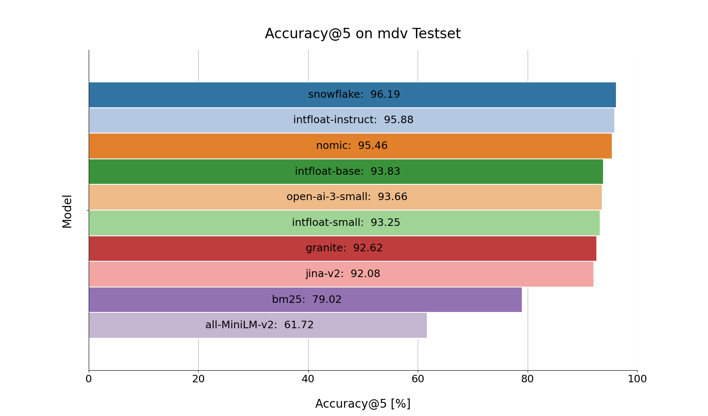

# Semantic Search Evaluation Framework

**A framework for evaluating semantic search across custom datasets, metrics, and embedding backends.**


[](https://github.com/machinelearningZH/semantic-search-eval)
[](https://github.com/machinelearningZH/semantic-search-eval/stargazers)
[](https://github.com/machinelearningZH/semantic-search-eval/issues)
[](https://img.shields.io/github/issues-pr/machinelearningZH/semantic-search-eval)
[](https://github.com/machinelearningZH/semantic-search-eval)
<a href="https://github.com/astral-sh/ruff"></a>

<details>
<summary>Contents</summary>

- [Features](#features)
- [Installation](#installation)
- [Usage](#usage)
  - [Data Format](#data-format)
  - [Configuration](#configuration)
  - [OpenAI Key](#openai-key)
  - [Running Evaluations](#running-evaluations)
- [Project Team](#project-team)
- [Feedback and Contributing](#feedback-and-contributing)
   - [Adding Models & Metrics](#adding-new-metrics-and-models)
- [License](#license)

</details>




## Features
- **Flexible model integration**: HuggingFace, OpenAI, BM25, and more.
- **Simple YAML-based configuration**.
- **Custom evaluation metrics**: e.g., Accuracy@k, Latency.
- **Integrated visualizations** via `seaborn`/`matplotlib`.

## Installation
To install the project and its dependencies, follow these steps:

```bash
# Clone the repository
git clone https://github.com/machinelearningZH/semantic-search-eval.git
cd semantic-search-eval

# Install venv and dependencies
pip3 install uv
uv venv
source .venv/bin/activate
uv sync
```

## Usage

###  Data Format
You need two input files:

- `docs`: A CSV or parquet file with a column named `text` containing the document content. Each row represents a single document.
- `queries`: A CSV or parquet file with two columns:
  - `search_query`: The query text.
  - `idx`: The document ID that corresponds to the correct answer for the query.

> [!NOTE]
> If you do not already have test queries for your documents, the tool can create them automatically via OpenAI or naive keyword extraction (for private data). The prompt used for query generation via OpenAI is in German and can be edited in [semsearcheval/prompts.py](semsearcheval/prompts.py). If you use the naive keyword extraction mechanism, be aware that this will boost the performance of BM25 in comparison to the embedding models.

> [!NOTE]
> Embedding models have a maximum input length - more on this in the next section. If your documents exceed this length, they should be split into smaller chunks before evaluation to ensure compatibility with the models. All preprocessing (e.g., cleaning, tokenization) should be completed before evaluation, as it is not (yet) supported in this toolkit.

### Configuration
Create a YAML config to define datasets, models, and metrics. Use [`configs/example.yaml`](configs/example.yaml) as a template.

Key fields:

- `folder`: where to save results and plots
- `docs` and `queries`: paths to your documents and queries in CSV or parquet format
- `is-public-data`: set to true to use OpenAI query creator if data is public
- `max-len`: set to the **shortest model limit** to ensure fair evaluation with same input text length for all models
- `models`: define model backends and options

### OpenAI Key
To use OpenAI-based features:

1. Set the key as an environment variable:

```bash
export OPENAI_API_KEY="your-api-key"
```

2. Or add it to a `.env` file in the project root (the version above takes precedence):

```env
OPENAI_API_KEY=your-key
```

> [!WARNING]
> Never commit API keys to version control.

### Running Evaluations
Once your config is ready:

```bash
python semsearcheval/evaluate.py -c configs/your_config.yaml
```

Results will be saved in the specified `folder`, including a CSV file with stats and plots for each metric.

## Project Information
Semantic search is becoming increasingly important in public administration and many other areas. Intelligent search solutions like the ones we built [for the Staatsarchiv](https://github.com/machinelearningZH/ai-search_staatsarchiv) and [for our OGD metadata catalog](https://github.com/machinelearningZH/ogd_ai-search) help to make large collections of documents easier to search and use. However, with new embedding models being released all the time — both open-source and commercial and in various sizes — it can be hard to know which one works best for a specific task or dataset.

This tool was built to make it easier to compare these models in a transparent and reproducible way, using your own data and metrics.

- The tool lets you evaluate and compare models like OpenAI, HuggingFace, and BM25 on your own datasets.
- Setup is easy using a simple YAML configuration file.
- You can use automatically generated test queries or define your own for more targeted tests (e.g. to check for bias).
- Results are saved so you do not need to re-run old evaluations when testing new models.
- The tool provides a CSV with all results as well as visual plots to help with decision-making.
- It works with the OpenAI API but can also run completely offline or on-premise if your data is private.
- It is easy to extend with new datasets, models, or metrics as your needs change.

This project contributes to the broader goal of enabling fair and transparent deployment of AI systems in administrative and public service environments.

## Project Team

**Chantal Amrhein**, **Patrick Arnecke** – [Statistisches Amt Zürich: Team Data](https://www.zh.ch/de/direktion-der-justiz-und-des-innern/statistisches-amt/data.html)

## Feedback and Contributing

We welcome feedback and contributions! [Email us](mailto:datashop@statistik.zh.ch) or open an issue or pull request.

We use [`ruff`](https://docs.astral.sh/ruff/) for linting and formatting. 

Install pre-commit hooks and run tests before opening a pull request:
```bash
pre-commit install
pytest
```

### Adding New Metrics and Models

#### ➕ New Metric

- Implement the `Metric` interface in [`metrics.py`](semsearcheval/metrics.py)
- Register it in [`constants.py`](semsearcheval/constants.py)

#### ➕ New Model

- Implement the `Model` interface in [`models.py`](semsearcheval/models.py)
- Register it in [`constants.py`](semsearcheval/constants.py)


## License

This project is licensed under the MIT License. See the [LICENSE](LICENSE) file for details.


## Disclaimer

This evaluation tool (the Software) incorporates the open-source model `de_core_news_sm` from [spacy.io](https://spacy.io/) and evaluates user-defined open- and closed-sourced embedding models (the Models). The Software has been developed according to and with the intent to be used under Swiss law. Please be aware that the EU Artificial Intelligence Act (EU AI Act) may, under certain circumstances, be applicable to your use of the Software. You are solely responsible for ensuring that your use of the Software as well as of the underlying Models complies with all applicable local, national and international laws and regulations. By using this Software, you acknowledge and agree (a) that it is your responsibility to assess which laws and regulations, in particular regarding the use of AI technologies, are applicable to your intended use and to comply therewith, and (b) that you will hold us harmless from any action, claims, liability or loss in respect of your use of the Software.